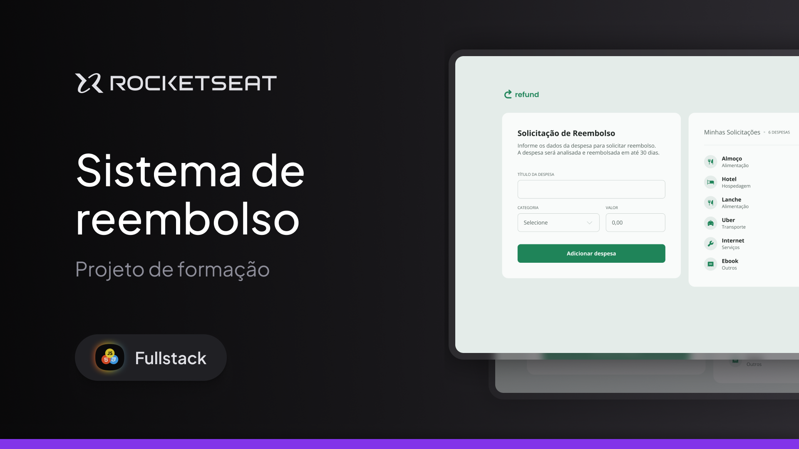

# Refund ✨

Refund é uma aplicação web de solicitação de reembolso e listagem de despesas.  
Este projeto foi desenvolvido durante a formação de **JavaScript**, como parte do processo de especialização em desenvolvimento web.  

  

## 📖 Sobre o Projeto

O **Refund** é um site que permite realizar solicitações de reembolso e visualizar despesas já cadastradas.  
A proposta é exercitar fundamentos de **JavaScript**, trabalhando também com a integração entre **HTML**, **CSS** e controle de versões com **Git/GitHub**.

## 🛠️ Tecnologias

As principais tecnologias utilizadas foram:

-   
-   
-   
-   
-   

---

<small>Thank you for reading! ❤️</small># refund
